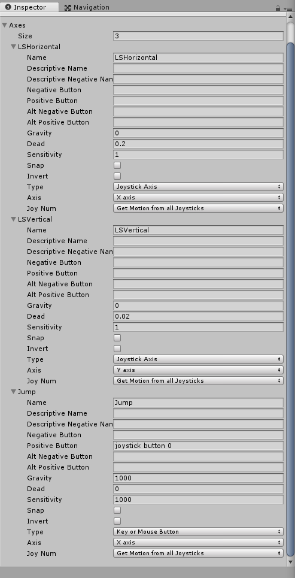

# C#-3D Character Controller Scripts

Hi Everyone, 

Below I will outline how to use these plug and play scripts to automatically use a controller to control your characters in Unity from the start of a 3D Project.

## Create a Unity 3D Enviornment

1. Add a plane to your enviornment and set the Scale's X Y and Z (under the Transform tab in the inspector) to 10, this will act as the floor.
2. Add a cube slightly above your plane, this will act as your character. Also add a Ridgid Body to it.
3. Create two new materials in your assets folder, and change the Albedo to which ever color you'd like, one for your character and one for the floor. When you are finished, drag these materials on top of the objects to change their color.

## Setup Input Axis

Import the Gaming Scripts:
Go to the folder you've cloned and drag the assets in.

Add three new Axes for the Inputs of the Left Thumbstick and A button.

Go to **Edit --> Project Settings --> Input**, Open the Axis Tab and set the Size to 3 higher than it already is.
If the Size of Axis is 18, set it to 21.

**These are the settings for the Axes:** 

Your Character will now be able to move and jump using the Left Thumbstick and the A button on your Xbox controller.

